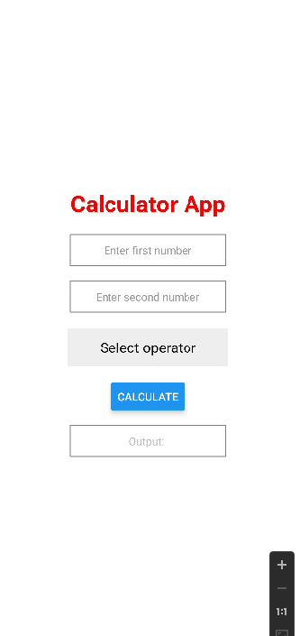

# react-native-calculator-android

## Basic react native example for simple calculator (Android)

## Use below commands to setup and run the project
`$ npm install -g react-native-cli`

`$ npm install -g create-react-native-app`

`$ create-react-app YOURAPPNAME`

`$ cd RELOCATE-TO-YOURAPPNAME`

`$ react-native run-android`

## Sample output

## Sample 1

## Sample 2

## Sample 3
